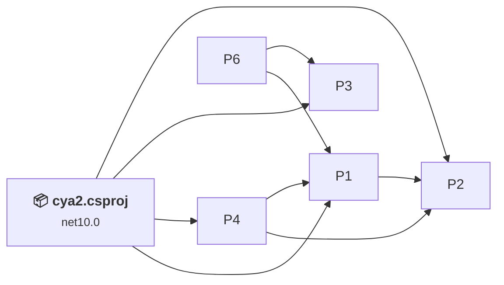
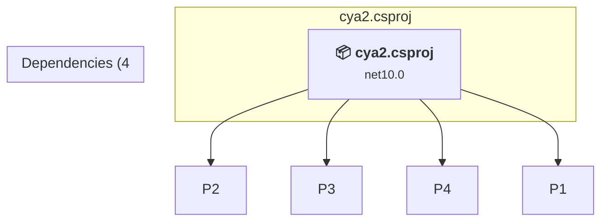

# Projects and dependencies analysis

This document provides a comprehensive overview of the projects and their dependencies in the context of upgrading to .NETCoreApp,Version=v10.0.

## Table of Contents

- [Executive Summary](#executive-Summary)
  - [Highlevel Metrics](#highlevel-metrics)
  - [Projects Compatibility](#projects-compatibility)
  - [Package Compatibility](#package-compatibility)
  - [API Compatibility](#api-compatibility)
  - [Binding Redirect Configuration](#binding-redirect-configuration)
- [Aggregate NuGet packages details](#aggregate-nuget-packages-details)
- [Top API Migration Challenges](#top-api-migration-challenges)
  - [Technologies and Features](#technologies-and-features)
  - [Most Frequent API Issues](#most-frequent-api-issues)
- [Projects Relationship Graph](#projects-relationship-graph)
- [Project Details](#project-details)

  - [%USERPROFILE%\dev\Cya2\src\Cya2.Application\Cya2.Application.csproj](#%userprofile%devcya2srccya2applicationcya2applicationcsproj)
  - [%USERPROFILE%\dev\Cya2\src\Cya2.Core\Cya2.Core.csproj](#%userprofile%devcya2srccya2corecya2corecsproj)
  - [%USERPROFILE%\dev\Cya2\src\Cya2.Infrastructure\Cya2.Infrastructure.csproj](#%userprofile%devcya2srccya2infrastructurecya2infrastructurecsproj)
  - [%USERPROFILE%\dev\Cya2\src\Cya2.Shared\Cya2.Shared.csproj](#%userprofile%devcya2srccya2sharedcya2sharedcsproj)
  - [%USERPROFILE%\dev\Cya2\tests\Cya2.Application.Tests\Cya2.Application.Tests.csproj](#%userprofile%devcya2testscya2applicationtestscya2applicationtestscsproj)
  - [cya2.csproj](#cya2csproj)

## Executive Summary

### Highlevel Metrics

| Metric | Count | Status |
| :--- | :---: | :--- |
| Total Projects | 6 | 5 require upgrade |
| Total NuGet Packages | 20 | All compatible |
| Total Code Files | 199 |  |
| Total Code Files with Incidents | 7 |  |
| Total Lines of Code | 18471 |  |
| Total Number of Issues | 20 |  |
| Estimated LOC to modify | 3+ | at least 0.0% of codebase |

### Projects Compatibility

| Project | Target Framework | Difficulty | Package Issues | API Issues | Binding Issues | Est. LOC Impact | Description |
| :--- | :---: | :---: | :---: | :---: | :---: | :---: | :--- |
| [%USERPROFILE%\dev\Cya2\src\Cya2.Application\Cya2.Application.csproj](#%userprofile%devcya2srccya2applicationcya2applicationcsproj) | net8.0 | 🟢 Low | 4 | 0 | 0 |  | ClassLibrary, Sdk Style = True |
| [%USERPROFILE%\dev\Cya2\src\Cya2.Core\Cya2.Core.csproj](#%userprofile%devcya2srccya2corecya2corecsproj) | net8.0 | 🟢 Low | 0 | 0 | 0 |  | ClassLibrary, Sdk Style = True |
| [%USERPROFILE%\dev\Cya2\src\Cya2.Infrastructure\Cya2.Infrastructure.csproj](#%userprofile%devcya2srccya2infrastructurecya2infrastructurecsproj) | net8.0 | 🟢 Low | 6 | 1 | 0 | 1+ | ClassLibrary, Sdk Style = True |
| [%USERPROFILE%\dev\Cya2\src\Cya2.Shared\Cya2.Shared.csproj](#%userprofile%devcya2srccya2sharedcya2sharedcsproj) | net8.0 | 🟢 Low | 1 | 0 | 0 |  | ClassLibrary, Sdk Style = True |
| [%USERPROFILE%\dev\Cya2\tests\Cya2.Application.Tests\Cya2.Application.Tests.csproj](#%userprofile%devcya2testscya2applicationtestscya2applicationtestscsproj) | net8.0 | 🟢 Low | 1 | 2 | 0 | 2+ | DotNetCoreApp, Sdk Style = True |
| [cya2.csproj](#cya2csproj) | net10.0 | ✅ None | 0 | 0 | 0 |  | AspNetCore, Sdk Style = True |

### Package Compatibility

| Status | Count | Percentage |
| :--- | :---: | :---: |
| ✅ Compatible | 20 | 100.0% |
| ⚠️ Incompatible | 0 | 0.0% |
| 🔄 Upgrade Recommended | 0 | 0.0% |
| ***Total NuGet Packages*** | ***20*** | ***100%*** |

### API Compatibility

| Category | Count | Impact |
| :--- | :---: | :--- |
| 🔴 Binary Incompatible | 0 | High - Require code changes |
| 🟡 Source Incompatible | 3 | Medium - Needs re-compilation and potential conflicting API error fixing |
| 🔵 Behavioral change | 0 | Low - Behavioral changes that may require testing at runtime |
| ✅ Compatible | 21718 |  |
| ***Total APIs Analyzed*** | ***21721*** |  |

## Aggregate NuGet packages details

| Package | Current Version | Suggested Version | Projects | Description |
| :--- | :---: | :---: | :--- | :--- |
| BouncyCastle.Cryptography | 2.6.2 |  | [cya2.csproj](#cya2csproj) | ✅Compatible |
| Dapper | 2.1.79 |  | [cya2.csproj](#cya2csproj) | ✅Compatible |
| EPPlus | 8.6.0 |  | [cya2.csproj](#cya2csproj) | ✅Compatible |
| EPPlus.Interfaces | 8.4.0 |  | [cya2.csproj](#cya2csproj) | ✅Compatible |
| Google.Protobuf | 3.32.0 |  | [cya2.csproj](#cya2csproj) | ✅Compatible |
| K4os.Compression.LZ4 | 1.3.8 |  | [cya2.csproj](#cya2csproj) | ✅Compatible |
| K4os.Compression.LZ4.Streams | 1.3.8 |  | [cya2.csproj](#cya2csproj) | ✅Compatible |
| K4os.Hash.xxHash | 1.0.8 |  | [cya2.csproj](#cya2csproj) | ✅Compatible |
| Microsoft.AspNetCore.App.Internal.Assets | 10.0.12 |  | [cya2.csproj](#cya2csproj) | ✅Compatible |
| Microsoft.AspNetCore.Authentication.Google | 10.0.8 |  | [cya2.csproj](#cya2csproj) | ✅Compatible |
| Microsoft.IO.RecyclableMemoryStream | 3.0.1 |  | [cya2.csproj](#cya2csproj) | ✅Compatible |
| MySql.Data | 9.7.0 |  | [cya2.csproj](#cya2csproj) | ✅Compatible |
| Radzen.Blazor | 10.4.7 |  | [cya2.csproj](#cya2csproj) | ✅Compatible |
| System.ComponentModel.Annotations | 5.0.0 |  | [cya2.csproj](#cya2csproj) | ✅Compatible |
| System.Configuration.ConfigurationManager | 8.0.0 |  | [cya2.csproj](#cya2csproj) | ✅Compatible |
| System.Security.Cryptography.Pkcs | 10.0.7 |  | [cya2.csproj](#cya2csproj) | ✅Compatible |
| System.Security.Cryptography.ProtectedData | 8.0.0 |  | [cya2.csproj](#cya2csproj) | ✅Compatible |
| System.Security.Permissions | 8.0.0 |  | [cya2.csproj](#cya2csproj) | ✅Compatible |
| System.Windows.Extensions | 8.0.0 |  | [cya2.csproj](#cya2csproj) | ✅Compatible |
| ZstdSharp.Port | 0.8.6 |  | [cya2.csproj](#cya2csproj) | ✅Compatible |

## Top API Migration Challenges

### Technologies and Features

| Technology | Issues | Percentage | Migration Path |
| :--- | :---: | :---: | :--- |

### Most Frequent API Issues

| API | Count | Percentage | Category |
| :--- | :---: | :---: | :--- |
| M:System.TimeSpan.FromSeconds(System.Double) | 2 | 66.7% | Source Incompatible |
| M:System.TimeSpan.FromMinutes(System.Double) | 1 | 33.3% | Source Incompatible |

## Projects Relationship Graph

Legend:
📦 SDK-style project
⚙️ Classic project

## Project Details

### cya2.csproj

#### Project Info

- **Current Target Framework:** net10.0✅
- **SDK-style**: True
- **Project Kind:** AspNetCore
- **Dependencies**: 4
- **Dependants**: 0
- **Number of Files**: 75
- **Lines of Code**: 1862
- **Estimated LOC to modify**: 0+ (at least 0.0% of the project)

#### Dependency Graph

Legend:
📦 SDK-style project
⚙️ Classic project

### API Compatibility

| Category | Count | Impact |
| :--- | :---: | :--- |
| 🔴 Binary Incompatible | 0 | High - Require code changes |
| 🟡 Source Incompatible | 0 | Medium - Needs re-compilation and potential conflicting API error fixing |
| 🔵 Behavioral change | 0 | Low - Behavioral changes that may require testing at runtime |
| ✅ Compatible | 0 |  |
| ***Total APIs Analyzed*** | ***0*** |  |

